# Dashboard Implementation Guide

Interactive thematic trading dashboard — three independently deployable components: core extraction library, FastAPI analytics API, and React frontend.

---

## Architecture

```mermaid
flowchart LR
    subgraph Frontend["React SPA"]
        Dashboard["Dashboard\nTop 10 themes"]
        ThemeDetail["Theme Detail\nStocks + regime + drift"]
        StockDetail["Stock Detail\nAll themes"]
        Promotion["Promotion\nHuman-in-the-loop"]
        Taxonomy["Taxonomy\nInteractive tree"]
    end

    subgraph Backend["FastAPI"]
        API["/api/v1/*"]
        subgraph Services
            Ranking["ranking.py"]
            Regime["regime.py"]
            Drift["drift.py"]
            Promo["promotion.py"]
            Snap["snapshot.py"]
        end
    end

    subgraph Data["SQLite"]
        Existing["stocks\nthemes\nstock_themes\nopen_themes"]
        New["theme_snapshots\ntheme_stock_snapshots\npromotion_log"]
    end

    Frontend --> API
    API --> Services
    Services --> Data
```



---

## Tech Stack

| Layer | Technology |
|-------|-----------|
| Backend | FastAPI + uvicorn |
| Frontend | React 18 + TypeScript + Vite + Tailwind CSS + Recharts |
| Database | SQLite (existing + 3 new tables) |
| Deployment | Independent containers via docker-compose |

---

## New Database Tables

### `theme_snapshots`

Daily aggregate metrics per canonical theme. Drives regime classification, ranking, and momentum calculation.

| Column | Type | Description |
|--------|------|-------------|
| snapshot_date | TEXT | ISO date (YYYY-MM-DD) |
| theme_name | TEXT | Canonical theme name |
| stock_count | INTEGER | Number of stocks tagged |
| total_market_cap | REAL | Sum of constituent market caps |
| avg_confidence | REAL | Mean confidence score |
| avg_freshness | REAL | Mean freshness (time decay) |
| news_mention_count | INTEGER | Narrative mention count |
| source_breakdown | TEXT | JSON of source counts |

### `theme_stock_snapshots`

Per-stock theme membership per snapshot date. Enables drift detection.

| Column | Type | Description |
|--------|------|-------------|
| snapshot_date | TEXT | ISO date |
| theme_name | TEXT | Canonical theme |
| ticker | TEXT | Stock ticker |
| confidence | REAL | Theme confidence |
| source | TEXT | Extraction source |

### `promotion_log`

Audit trail for human-in-the-loop promotions.

| Column | Type | Description |
|--------|------|-------------|
| open_theme_text | TEXT | Original open theme |
| canonical_name | TEXT | Promoted canonical name |
| parent_theme | TEXT | Parent in taxonomy tree |
| category | TEXT | Theme category |
| promoted_at | TIMESTAMP | When promoted |
| stock_count_at_promotion | INTEGER | Stocks at time of promotion |
| avg_confidence_at_promotion | REAL | Confidence at promotion |

---

## API Reference

### Theme Endpoints

| Method | Path | Description |
|--------|------|-------------|
| GET | `/api/v1/themes/top?sort_by=stock_count\|volume\|momentum&limit=10` | Top themes ranked |
| GET | `/api/v1/themes/{name}` | Theme detail with stocks and regime |
| GET | `/api/v1/themes/{name}/regime` | Lifecycle regime with signal breakdown |
| GET | `/api/v1/themes/{name}/drift?days=90` | Drift analysis (Jaccard + sub-theme shift) |
| GET | `/api/v1/themes/{name}/history?days=90` | Time series from snapshots |

### Stock Endpoints

| Method | Path | Description |
|--------|------|-------------|
| GET | `/api/v1/stocks/{ticker}` | Stock detail with all themes |
| GET | `/api/v1/stocks?theme={name}` | Stocks for a theme |

### Search

| Method | Path | Description |
|--------|------|-------------|
| GET | `/api/v1/search?q=...` | Unified search across themes, stocks, open themes |

### Promotion (Human in the Loop)

| Method | Path | Description |
|--------|------|-------------|
| GET | `/api/v1/promotions/candidates` | Open themes ready for promotion |
| POST | `/api/v1/promotions/promote` | Promote to canonical (updates DB + taxonomy.yaml) |
| POST | `/api/v1/promotions/dismiss` | Dismiss a candidate |
| GET | `/api/v1/promotions/history` | Promotion audit log |

### Other

| Method | Path | Description |
|--------|------|-------------|
| GET | `/api/v1/taxonomy/tree` | Full taxonomy hierarchy as nested JSON |
| GET | `/api/v1/stats` | Database statistics |
| POST | `/api/v1/snapshots/take` | Manually trigger a snapshot |

---

## Theme Lifecycle Regimes

Each canonical theme is classified into a lifecycle stage based on snapshot time series:

| Regime | Condition | Color |
|--------|-----------|-------|
| **Emergence** | stock_count <= 5 AND growing, OR first seen < 30 days ago | Green |
| **Diffusion** | Growing stock count AND stable/rising confidence, 5-20 stocks | Blue |
| **Consensus** | 20+ stocks, high media coverage, 3+ data sources | Amber |
| **Monetization** | 15+ stocks, avg confidence > 70%, stable basket (velocity ~0) | Purple |
| **Decay** | Declining stock count AND confidence AND news mentions | Red |

### Signals Computed

| Signal | Definition |
|--------|-----------|
| `stock_count_velocity` | Linear regression slope of stock_count over 90-day window |
| `confidence_trend` | Slope of avg_confidence over time |
| `news_trend` | Change in news mentions (recent 30d vs prior 30d) |
| `source_diversity` | Number of distinct extraction sources |
| `days_since_first_seen` | Days since theme first appeared in snapshots |

---

## Drift Detection

Measures how a theme's stock basket changes over time.

### Metrics

- **Jaccard drift**: `1 - |S0 AND S1| / |S0 OR S1|` where S0 and S1 are stock sets at two time points
- **Entrants**: New stocks that joined the theme
- **Exits**: Stocks that dropped from the theme
- **Sub-theme shift**: For parent themes with children in the taxonomy tree, shows percentage distribution change (e.g., "AI infra" shifting from GPU to power grid)

### Weekly Time Series

Jaccard drift computed at weekly intervals relative to the earliest snapshot in the lookback window.

---

## Theme Ranking

| Sort Mode | Definition |
|-----------|-----------|
| `stock_count` | Current number of stocks tagged |
| `volume` | Sum of market cap of constituent stocks |
| `momentum` | Linear regression slope of stock_count over 90 days |

---

## Human-in-the-Loop Promotion

1. The system identifies promotion candidates via `suggest_promotions()` (open themes in 5+ stocks with high quality)
2. Users review candidates on the Promotions page
3. **Promote**: assigns a canonical name, optional parent theme and category. Updates the `themes` table, `taxonomy.yaml`, and logs to `promotion_log`
4. **Dismiss**: sets `mapped_similarity = 1.0` on the open theme, suppressing it from future candidate lists

---

## Daily Snapshot

The snapshot captures the current state of all themes for historical tracking:

```bash
# Run daily after batch build
python scripts/take_snapshot.py --db stock_themes.db

# Or via cron
0 6 * * * cd /path/to/project && .venv/bin/python scripts/take_snapshot.py
```

You can also trigger manually via the API:
```bash
curl -X POST http://localhost:8000/api/v1/snapshots/take
```

---

## Development

### API Backend

```bash
cd api
pip install -e .
STOCK_THEMES_DB=../stock_themes.db TAXONOMY_YAML_PATH=../stock_themes/taxonomy.yaml \
  uvicorn themes_api.app:app --reload --port 8000
```

OpenAPI docs at `http://localhost:8000/docs`

### Frontend

```bash
cd dashboard/frontend
npm install
npm run dev
```

Vite dev server at `http://localhost:5173` with API proxy to `:8000`.

---

## Production Deployment

### Combined (local dev)

```bash
docker compose up   # API :8000 + Frontend :3000
```

### Separate Machines (production)

The API and frontend can be deployed independently on different machines.

**API machine:**

```bash
cd api
docker compose up
# or manually:
docker build -t themes-api .
docker run -p 8000:8000 \
  -v /data/stock_themes.db:/data/stock_themes.db \
  -v /data/taxonomy.yaml:/data/taxonomy.yaml \
  -e STOCK_THEMES_DB=/data/stock_themes.db \
  -e TAXONOMY_YAML_PATH=/data/taxonomy.yaml \
  -e CORS_ORIGINS=https://dashboard.example.com \
  themes-api
```

**Frontend machine:**

```bash
cd dashboard/frontend
docker compose up
# or manually:
docker build --build-arg VITE_API_BASE_URL=https://api.example.com/api/v1 -t themes-frontend .
docker run -p 80:80 themes-frontend
```

**Environment variables:**

| Variable | Component | Description |
|----------|-----------|-------------|
| `CORS_ORIGINS` | API | Comma-separated allowed origins (default: `http://localhost:5173`) |
| `VITE_API_BASE_URL` | Frontend (build-time) | Absolute URL to the API (required for Docker build) |
| `STOCK_THEMES_DB` | API | Path to SQLite database |
| `TAXONOMY_YAML_PATH` | API | Path to taxonomy.yaml |

---

## File Layout

```
api/                             # Standalone FastAPI analytics backend
  themes_api/
    __init__.py
    app.py                       # FastAPI application factory
    config.py                    # Environment-based configuration
    db.py                        # Self-contained DB layer (schema + queries)
    taxonomy.py                  # Standalone ThemeTree reader
    response_models.py           # Pydantic schemas
    routers/
      themes.py                  # /api/v1/themes/*
      stocks.py                  # /api/v1/stocks/*
      search.py                  # /api/v1/search
      promotions.py              # /api/v1/promotions/*
      taxonomy.py                # /api/v1/taxonomy/tree
      admin.py                   # /api/v1/stats, snapshots
    services/
      regime.py                  # Lifecycle regime classifier
      drift.py                   # Drift detection (Jaccard + sub-theme)
      ranking.py                 # Theme ranking
      snapshot.py                # Daily snapshot service
      promotion.py               # Promote open themes to canonical
  pyproject.toml                 # fastapi, uvicorn, pyyaml only
  Dockerfile
  scripts/
    take_snapshot.py             # CLI for daily snapshots

dashboard/frontend/              # React SPA (independently deployable)
  package.json
  vite.config.ts                 # Proxy /api to API in dev
  nginx.conf                     # SPA routing + API proxy (production)
  Dockerfile                     # node build → nginx
  src/
    api/client.ts                # Typed API client (configurable base URL)
    pages/
      DashboardPage.tsx
      ThemeDetailPage.tsx
      StockDetailPage.tsx
      SearchPage.tsx
      PromotionPage.tsx
      TaxonomyPage.tsx
    components/
      Layout.tsx
      SearchBar.tsx
      RegimeBadge.tsx

docker-compose.yml               # Combined deployment
```
