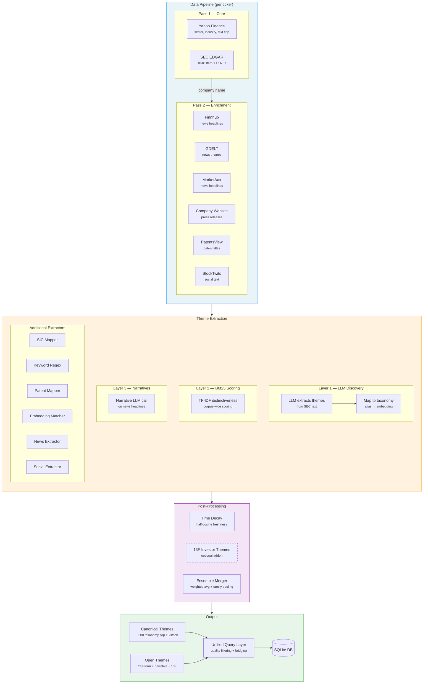

# Stock Themes

## What is this

A Python library that generates investment themes for all US stocks and stores them in a SQLite database. It produces two types of output:

- **Canonical themes** — mapped to a fixed taxonomy of ~200 themes for cross-stock comparison and ETF mapping
- **Open themes** — free-form themes from LLM and news that capture specifics the taxonomy can't (e.g., "breast cancer immunotherapy", "HER2/neu targeted therapy", "biotech catalyst", "penny stock")

Both tiers are combined via a **unified query layer** with quality filtering, so downstream consumers see one ranked list per stock.

---

## Architecture



### Data Pipeline (per ticker, two-pass)

**Pass 1 — Core providers** (get company fundamentals + name):

| Provider | Data | Key required |
|---|---|---|
| Yahoo Finance | Sector, industry, market cap, business summary, news headlines | No |
| SEC EDGAR | 10-K → Item 1 (Business) + Item 1A (Risk Factors) + Item 7 (MD&A), extracted as separate sections | `SEC_EDGAR_EMAIL` |

**Pass 2 — Enrichment providers** (need company name from Pass 1):

| Provider | Data | Key required |
|---|---|---|
| Finnhub | Company news headlines (90 days, up to 100 articles) | `FINNHUB_API_KEY` |
| GDELT | News themes, titles, tone (3 months) | No (public API, rate-limited) |
| MarketAux | News headlines by ticker | `MARKETAUX_API_TOKEN` |
| Company Website | Press releases / newsroom articles via sitemap or common paths | No |
| PatentsView | Patent titles + CPC codes | `PATENTSVIEW_API_KEY` |
| StockTwits | Social sentiment + discussion text | `STOCKTWITS_ACCESS_TOKEN` |

News titles are deduplicated across all providers (normalized lowercase comparison). All news providers preserve article publication dates as `DatedArticle` objects for time-decay scoring.

### Smart SEC Section Extraction

For 10-K filings, three sections are extracted separately via edgartools:

| Section | Attribute | Typical size | Content |
|---|---|---|---|
| Item 1 (Business) | `obj.business` | 15K–75K chars | Company overview, products, pipeline |
| Item 1A (Risk Factors) | `obj.risk_factors` | 50K–200K chars | Competitive threats, regulatory risks |
| Item 7 (MD&A) | `obj.management_discussion` | 10K–20K chars | Forward-looking clinical/strategic priorities |

**LLM budget allocation** (200K chars ≈ 100K tokens):
1. Full Item 1 (Business) — always included
2. Full Item 7 (MD&A) — always included
3. Item 1A (Risk Factors) — with remaining budget; uses **70/30 head+tail truncation** if oversized (captures overview risks from start + specific/recent risks from end)

For 10-Q: MD&A is the primary business text. For S-1: no MD&A available.

### Theme Extraction (3 layers)

**Layer 1 — LLM Theme Discovery** (stocks with market cap ≥ $100M):

Sends SEC text (up to 200K chars with smart budget allocation across Item 1/7/1A) to an LLM. The LLM extracts up to 20 free-form themes with confidence scores. These are then mapped to canonical taxonomy via a two-pass strategy:

1. **Normalizer alias lookup** — exact match against 150+ aliases (fast, high precision)
2. **Embedding similarity fallback** — cosine similarity ≥ 0.60 against theme embeddings using `all-MiniLM-L6-v2`

Themes that map to canonical go to Tier 1 output. Themes that don't map are stored as **open themes** (Tier 2) instead of being dropped.

**Layer 2 — BM25 Corpus Distinctiveness Scoring**:

Builds a TF-IDF matrix across all SEC filings in the database. For each open theme, scores how distinctive its terms are for this company vs. the entire corpus. "Cloud computing" in every filing → score drops to zero. "Peptide vaccine" in only one filing → score spikes. Handles document length normalization natively.

The corpus is rebuilt periodically (every 500 tickers or at end of batch run) and cached to disk.

**Layer 3 — Market Narrative Extraction**:

A separate LLM call on news headlines extracts market perception themes — how investors/market see the stock:
- Market groupings: "magnificent 7", "meme stock"
- Momentum: "AI winner", "turnaround play"
- Macro: "rate sensitive", "cyclical", "defensive"
- Geopolitical: "China exposure", "tariff risk"
- Style: "value trap", "dividend aristocrat"
- Event-driven: "M&A target", "short squeeze", "insider buying"

These are stored as open themes with `source="narrative"`.

### Time Decay

All news-derived themes are weighted by article freshness using a half-cosine decay curve:

- **Days 0–30**: score = 1.0 (fresh)
- **Days 30–365**: cosine decay from 1.0 → 0.0
- **Days 365+**: score = 0.0 (stale)
- **Unknown date**: score = 0.5

The freshness score (average decay across a stock's articles) is applied as a confidence multiplier on narrative and news-sourced themes. Stored in `open_themes.freshness`.

### Company Website News

Scrapes press releases and newsroom articles directly from company websites:

1. Tries `{website}/sitemap.xml` — searches for URLs matching keywords (news, press, media, blog, release)
2. Falls back to common paths (`/news`, `/newsroom`, `/press-releases`, `/media`, `/investors/news`)
3. Extracts article links (max depth 2, max 20 articles per company)
4. Converts each article URL to markdown via a service chain:
   - Primary: `https://markdown.new/{url}`
   - Fallback 1: `https://defuddle.md/{url}`
   - Fallback 2: `https://r.jina.ai/{url}`
5. Extracts title and publication date from the markdown

Articles merge into the existing `dated_articles` pipeline and benefit from time-decay scoring.

### Famous Investor Holdings (13F) — Optional

An **opt-in** addon (disabled by default) that tracks quarterly SEC 13F filings from famous investors and generates narrative themes like "buffett new position" or "ark significantly trimmed".

**How it works:**
1. Fetches recent 13F-HR filings from SEC EDGAR for each tracked investor
2. Parses the XML information table (issuer name, shares, value)
3. Resolves issuer names to tickers via fuzzy matching against the stocks database
4. Compares current vs previous quarter: detects `new_position`, `sold_entire`, `added`, `trimmed`
5. Writes open themes with `source="13f"`

**Tracked investors** (15): Buffett (Berkshire), ARK (Cathie Wood), Druckenmiller (Duquesne), Burry (Scion), Ackman (Pershing Square), Dalio (Bridgewater), Tepper (Appaloosa), Einhorn (Greenlight), Klarman (Baupost), Loeb (Third Point), Icahn, Soros, Tiger Global, Coatue, Fundsmith.

**Fully decoupled**: the main `build_database()` pipeline works identically without it. Enable via `thirteen_f.enabled: true` in `settings.yaml`, or run standalone:

```python
from stock_themes import build_investor_themes
build_investor_themes(db_path="stock_themes.db")
```

```bash
# CLI
python -m stock_themes.thirteen_f_cli --db stock_themes.db
```

### Additional Extractors

| Extractor | Method | Weight |
|---|---|---|
| SIC Mapper | Rule-based lookup from SIC codes | 0.5 |
| Keyword Extractor | ~60 regex patterns (biotech diseases, drug modalities, clinical stages, tech, energy) | 0.8 |
| Patent Mapper | CPC code → theme mapping | 0.7 |
| Embedding Matcher | Cosine similarity of text chunks against theme embeddings | 0.85 |
| News Extractor | GDELT theme code mapping | 0.6 |
| Social Extractor | Keyword patterns on StockTwits text | 0.4 |

### Ensemble Merger

All canonical themes are grouped by normalized name, then scored:
- Weighted average of confidences by source (LLM=1.0 highest, SIC=0.5 lowest)
- Multi-source bonus: +0.05 per additional confirming source (max +0.15)
- Generic terms blocked ("technology", "company", "stock", etc.)
- Clinical stage dedup: keeps only the most advanced stage (e.g., Phase 3 beats Phase 1)

Final output: top 10 canonical themes + all open themes per stock.

### Hierarchical Theme Taxonomy

A hand-curated tree (`taxonomy.yaml`) organizes ~129 themes into ~45 root families:

```
artificial intelligence
├── generative ai
│   └── large language models
├── machine learning
│   └── deep learning
├── computer vision
├── natural language processing
├── responsible ai
└── healthcare ai
```

**Family-aware confidence pooling** in the ensemble:
- Groups themes by root ancestor family
- Breadth bonus: +0.03 per additional family member (capped at +0.10)
- Sibling corroboration: 30% of avg sibling confidence, scaled by breadth
- Keeps deepest 3 themes per family (most specific leaves)

**Tree-aware querying**: `find_stocks("artificial intelligence")` automatically expands to all descendants (generative ai, machine learning, deep learning, etc.) via BFS traversal.

An offline clustering script (`scripts/suggest_taxonomy.py`) uses agglomerative clustering on theme embeddings to suggest new taxonomy groupings.

### Unified Query Layer

Canonical and open themes are combined via three strategies:

**1. Unified per-ticker query** (`get_all_themes(ticker)`):
- Returns canonical + quality-filtered open themes in one ranked list
- Each result tagged with `tier` ("canonical" or "open")
- Open themes filtered by composite quality score: `quality = 0.6 × confidence + 0.4 × distinctiveness`
- Source-specific thresholds: LLM themes (min confidence 0.5, quality 0.35) vs narrative themes (min confidence 0.6, quality 0.40)
- Open themes >85% similar to a canonical theme are suppressed as redundant

**2. Semantic bridging** (in `find_stocks()`):
- When canonical search (with taxonomy descendants) returns zero results, falls back to LIKE search on `open_themes` with quality filters
- E.g., `find_stocks("breast cancer")` finds stocks via their open themes even though "breast cancer" isn't a canonical theme

**3. Promotion pipeline** (`suggest_promotions()`):
- Identifies open themes appearing in 5+ stocks with high avg confidence and distinctiveness
- Returns human-reviewable candidates with nearest canonical mapping for taxonomy placement
- No auto-promotion — adding to canonical requires editing `taxonomy.yaml` and `themes.py`

### Database Schema

```
stocks          — ticker, name, sector, industry, market_cap, etc.
themes          — canonical theme names + categories (FK target)
stock_themes    — ticker × theme_id with confidence, source, evidence
open_themes     — free-form themes with distinctiveness, freshness, source (llm/narrative/13f), nearest canonical mapping
social_messages — accumulated StockTwits messages for monthly analysis
```

---

## Prerequisites

| Requirement | Detail |
|---|---|
| **Python** | 3.11 or newer |
| **OS** | macOS, Linux, or WSL2 |
| **RAM** | 4 GB minimum, 8 GB+ recommended |
| **Disk** | ~2 GB free (embedding model ~90 MB, DB ~200 MB, cache ~500 MB) |

### API Keys

All keys go in `.env` (or `~/Programs/.env`). All config goes in `stock_themes/settings.yaml`.

| Key | Source | Required? | Cost |
|---|---|---|---|
| `KIMI_API_KEY` | [platform.moonshot.ai](https://platform.moonshot.ai) | Yes (default LLM) | ~$5/month |
| `MINIMAX_API_KEY` | [platform.minimaxi.com](https://platform.minimaxi.com) | If using MiniMax | Similar |
| `GLM_API_KEY` | [open.bigmodel.cn](https://open.bigmodel.cn) | If using GLM | Similar |
| `SEC_EDGAR_EMAIL` | Any valid email | Yes | Free |
| `FINNHUB_API_KEY` | [finnhub.io](https://finnhub.io) | Recommended | Free tier available |
| `PATENTSVIEW_API_KEY` | [PatentsView](https://patentsview-support.atlassian.net/servicedesk/customer/portal/1/group/1/create/18) | Optional | Free |
| `MARKETAUX_API_TOKEN` | [marketaux.com](https://www.marketaux.com/) | Optional | Free tier available |
| `HF_TOKEN` | [huggingface.co](https://huggingface.co/settings/tokens) | Optional | Free |
| `STOCKTWITS_ACCESS_TOKEN` | [api.stocktwits.com](https://api.stocktwits.com/developers) | Optional (frozen) | Free |
| `WEBSHARE_USERNAME` / `WEBSHARE_PASSWORD` | [webshare.io](https://www.webshare.io/) | Optional (rotating proxy) | Paid |

The system degrades gracefully — each missing key disables one data source.

---

## Installation

```bash
cd /path/to/stock_themes

python3.11 -m venv .venv
source .venv/bin/activate

# CPU-only PyTorch (saves ~1.5 GB)
pip install torch --index-url https://download.pytorch.org/whl/cpu
pip install -e .
```

---

## Configuration

### `.env` (secrets only)

```env
LLM_PROVIDER=kimi
KIMI_API_KEY=sk-xxxxxxxxxxxxxxxxxxxxxxxx
SEC_EDGAR_EMAIL=yourname@yourdomain.com
FINNHUB_API_KEY=your_finnhub_key
HF_TOKEN=hf_xxxxxxxxxxxxxxxxxxxxxxxx
PATENTSVIEW_API_KEY=your_patentsview_key
```

### `stock_themes/settings.yaml` (everything else)

All non-secret configuration: LLM provider URLs/models, thresholds, rate limits, cache TTLs, corpus settings, narrative settings. Edit this file directly — no code changes needed.

Key settings:

| Setting | Default | What it controls |
|---|---|---|
| `llm.default_provider` | `kimi` | Which LLM to use |
| `llm.market_cap_threshold` | `100000000` ($100M) | Minimum market cap for LLM extraction |
| `llm.similarity_threshold` | `0.60` | Cosine similarity cutoff for LLM theme → canonical mapping |
| `llm.max_input_chars` | `200000` | SEC text budget for LLM input (~100K tokens) |
| `llm.head_ratio` | `0.7` | When truncating oversized sections: 70% from start, 30% from end |
| `corpus.rebuild_every_n_tickers` | `500` | How often to rebuild TF-IDF matrix |
| `narrative.max_titles` | `20` | Max news headlines for narrative LLM call |
| `narrative.max_themes` | `5` | Max narrative themes per stock |
| `semantic.similarity_threshold` | `0.6` | Chunk pre-filtering threshold |
| `unified.quality_weights` | `{confidence: 0.6, distinctiveness: 0.4}` | Composite quality score weights for open themes |
| `unified.max_mapped_similarity` | `0.85` | Suppress open themes too similar to canonical |
| `unified.promotion.min_stock_count` | `5` | Min stocks for promotion candidate |
| `time_decay.fresh_days` | `30` | Articles newer than this get full weight |
| `time_decay.stale_days` | `365` | Articles older than this get zero weight |
| `company_news.max_articles` | `20` | Max articles scraped per company website |
| `company_news.max_depth` | `2` | Max link-following depth from index pages |
| `company_news.cache_ttl_hours` | `48` | Cache TTL for scraped articles |
| `thirteen_f.enabled` | `false` | Enable 13F investor holdings (opt-in) |
| `thirteen_f.cache_ttl_days` | `7` | Cache TTL for 13F data |
| `thirteen_f.change_thresholds.significant_pct` | `50` | % change to qualify as "significantly added/trimmed" |

### Switching LLM providers

```env
LLM_PROVIDER=minimax
MINIMAX_API_KEY=your_key
```

Providers defined in `settings.yaml` under `llm.providers`.

---

## Quick Start

```python
from stock_themes import get_themes

result = get_themes("AAPL", use_llm=True)
for t in result.themes:
    print(f"  {t.confidence:.0%}  {t.name:<30s}  [{t.canonical_category}]")
for ot in result.open_themes:
    print(f"  {ot.confidence:.0%}  {ot.text:<30s}  [open/{ot.source}]  dist={ot.distinctiveness:.2f}")
```

---

## Full Database Build

```python
from stock_themes import build_database

build_database(
    db_path="stock_themes.db",
    max_themes_per_stock=10,
    skip_existing=True,
)
```

### Chunked cron build (recommended)

```cron
*/40 * * * * cd /path/to/stock_themes && \
  .venv/bin/python -c \
  "from stock_themes import build_database; build_database(max_tickers=250)" \
  >> stock_themes.log 2>&1
```

| `max_tickers` | Time per run | Runs to finish ~8,000 stocks |
|---|---|---|
| 100 | 15–30 min | ~80 runs (~2 days at */40) |
| 250 | 30–60 min | ~32 runs (~1 day at */40) |

### Seasonal refresh

```python
build_database(max_tickers=250, refresh_after="2025-01-01")
```

### 13F Investor Themes (quarterly, optional)

```bash
# Run standalone after each quarterly 13F filing season
python -m stock_themes.thirteen_f_cli --db stock_themes.db
```

Or from Python:

```python
from stock_themes import build_investor_themes
build_investor_themes(db_path="stock_themes.db")
```

### Custom ticker list

```python
build_database(tickers=["AAPL", "NVDA", "GLSI"], skip_existing=False)
```

---

## Querying

### Unified query (canonical + open themes combined)

```python
from stock_themes.db.queries import get_all_themes

# All themes for a stock, quality-filtered and ranked
for t in get_all_themes("NVDA"):
    print(f"  [{t['tier']:9s}] {t['confidence']:.0%}  {t['name']}")
```

### Find stocks by theme (with semantic bridging)

```python
from stock_themes.db.queries import find_stocks

# Canonical theme — expands to all taxonomy descendants
for s in find_stocks("artificial intelligence"):
    print(f"  {s['ticker']}  {s['name']}  ({s['confidence']:.0%})")

# Non-canonical query — falls back to open themes automatically
for s in find_stocks("breast cancer"):
    print(f"  {s['ticker']}  {s['name']}  ({s['confidence']:.0%})  [{s.get('tier', 'canonical')}]")
```

### Promotion candidates (open → canonical)

```python
from stock_themes.db.queries import suggest_promotions

# Open themes appearing in 5+ stocks with high quality
for c in suggest_promotions():
    print(f"  {c['theme_text']:30s}  stocks={c['stock_count']}  quality={c['avg_quality']:.2f}")
```

### Investor themes (13F)

```python
from stock_themes.db.queries import get_investor_themes, get_stocks_with_investor_activity

# All 13F themes for a stock
for t in get_investor_themes("AAPL"):
    print(f"  {t['theme_text']}  conf={t['confidence']:.0%}  {t['evidence']}")

# All stocks where Buffett has activity
for s in get_stocks_with_investor_activity("buffett"):
    print(f"  {s['ticker']}  {s['theme_text']}")
```

### Direct store access

```python
from stock_themes.db.store import ThemeStore

store = ThemeStore("stock_themes.db")

# Canonical themes for a stock
for t in store.get_themes_for_stock("NVDA"):
    print(f"  {t['confidence']:.0%}  {t['name']}")

# Open themes (free-form, including narrative)
for t in store.get_open_themes("NVDA"):
    print(f"  {t['confidence']:.0%}  {t['theme_text']}  [{t['source']}]  dist={t['distinctiveness']:.2f}")

# All stocks matching a canonical theme
for s in store.get_stocks_for_theme("artificial intelligence", min_confidence=0.5):
    print(f"  {s['ticker']}  {s['name']}  ({s['confidence']:.0%})")

# Discover emerging themes across the corpus
for t in store.get_emerging_themes(min_count=5):
    print(f"  {t['theme_text']}  ({t['stock_count']} stocks, avg dist={t['avg_distinctiveness']:.2f})")

store.close()
```

### SQL examples

```sql
-- Top 20 AI stocks
SELECT s.ticker, s.name, st.confidence
FROM stock_themes st
JOIN stocks s ON s.ticker = st.ticker
JOIN themes t ON t.id = st.theme_id
WHERE t.name = 'artificial intelligence'
ORDER BY st.confidence DESC LIMIT 20;

-- Most common open themes (emerging theme discovery)
SELECT theme_text, COUNT(*) as stocks, AVG(distinctiveness) as avg_dist
FROM open_themes
GROUP BY theme_text
HAVING stocks >= 3
ORDER BY stocks DESC LIMIT 30;

-- Narrative themes (how market sees stocks)
SELECT ticker, theme_text, confidence, freshness
FROM open_themes
WHERE source = 'narrative'
ORDER BY confidence DESC LIMIT 50;

-- 13F investor themes (requires thirteen_f.enabled)
SELECT ticker, theme_text, confidence, evidence
FROM open_themes
WHERE source = '13f'
ORDER BY updated_at DESC LIMIT 50;

-- Freshest open themes (highest time-decay scores)
SELECT ticker, theme_text, confidence, freshness
FROM open_themes
WHERE freshness IS NOT NULL
ORDER BY freshness DESC LIMIT 30;
```

---

## Daily StockTwits Collection

```bash
# Collect for all tickers in DB
python -m stock_themes.data.social stock_themes.db

# Cron: daily at 6 PM UTC
0 18 * * * cd /path/to/stock_themes && \
  .venv/bin/python -m stock_themes.data.social stock_themes.db \
  >> /tmp/stock_themes_social.log 2>&1
```

---

## File Layout

```
stock_themes/
├── .env                          # API keys (never commit)
├── stock_themes/
│   ├── settings.yaml             # All non-secret config
│   ├── config.py                 # Loads YAML + .env, exports constants
│   ├── models.py                 # Theme, OpenTheme, ThemeResult, CompanyProfile, DatedArticle, Holding, HoldingChange
│   ├── batch.py                  # Batch processor with corpus rebuild + optional 13F
│   ├── thirteen_f_cli.py         # Standalone 13F investor themes runner
│   ├── taxonomy.yaml             # Hierarchical theme tree (~45 families, 129 themes)
│   ├── data/                     # 9 data providers
│   │   ├── yahoo.py              # Yahoo Finance (core)
│   │   ├── sec_edgar.py          # SEC EDGAR — Item 1/1A/7 extraction (core)
│   │   ├── finnhub.py            # Finnhub news (enrichment, dated articles)
│   │   ├── news.py               # GDELT news (enrichment, dated articles)
│   │   ├── marketaux.py          # MarketAux news (enrichment, dated articles)
│   │   ├── company_news.py       # Company website news (sitemap/newsroom scraper)
│   │   ├── patents.py            # PatentsView (enrichment)
│   │   ├── social.py             # StockTwits (enrichment)
│   │   ├── thirteen_f.py         # SEC 13F-HR investor holdings (optional)
│   │   ├── investors.yaml        # Tracked investor registry (15 investors)
│   │   └── pipeline.py           # Two-pass orchestration + merge
│   ├── extraction/               # 10 theme extractors
│   │   ├── ensemble.py           # Merge + rank + family pooling + clinical stage dedup
│   │   ├── llm_extractor.py      # LLM → canonical + open themes
│   │   ├── narrative_extractor.py # News headlines → market narrative themes (time-decay aware)
│   │   ├── investor_extractor.py # 13F holdings → investor narrative themes
│   │   ├── time_decay.py         # Half-cosine freshness scoring
│   │   ├── keyword_extractor.py  # Regex patterns (~60 themes)
│   │   ├── embedding_matcher.py  # Cosine similarity matching
│   │   ├── sic_mapper.py         # SIC code → theme
│   │   ├── patent_mapper.py      # CPC code → theme
│   │   ├── news_extractor.py     # GDELT theme codes → theme
│   │   └── social_extractor.py   # Keywords in social text
│   ├── corpus/                   # BM25 distinctiveness scoring
│   │   └── tfidf.py              # TF-IDF corpus builder + scorer
│   ├── semantic/                 # Sentence-transformer pipeline
│   │   ├── embedder.py           # Theme embedding computation + cache
│   │   ├── filter.py             # Chunk-level semantic pre-filter
│   │   └── chunker.py            # Text chunking
│   ├── taxonomy/                 # ~200 canonical themes
│   │   ├── themes.py             # Theme descriptions + categories
│   │   ├── normalizer.py         # 150+ aliases for normalization
│   │   └── tree.py               # ThemeTree — hierarchical parent/child traversal
│   └── db/                       # SQLite persistence
│       ├── schema.py             # Table definitions (5 tables)
│       ├── store.py              # CRUD operations + filtered queries
│       └── queries.py            # Unified query API (get_all_themes, find_stocks, suggest_promotions)
│
├── scripts/
│   └── suggest_taxonomy.py       # Offline clustering to suggest taxonomy groupings
│
~/.cache/stock_themes/            # Auto-created cache
├── theme_embeddings.pt           # Cached theme vectors
├── tfidf_vectorizer.pkl          # Cached TF-IDF model
├── tfidf_matrix.npz              # Cached TF-IDF matrix
└── yahoo_finance/, sec_edgar/, patentsview/, gdelt/
```

---

## Cost Summary

| Item | Cost |
|---|---|
| Yahoo Finance, SEC EDGAR, GDELT, PatentsView, StockTwits, Company News, 13F | Free |
| Finnhub (free tier: 60 calls/min) | Free |
| Sentence-transformers (local CPU) | Free |
| LLM (2 calls/stock: theme extraction + narrative) | ~$10/month for all stocks ≥$100M |
| Rotating proxy (optional, for GDELT) | ~$5/month |
| **Total per month** | **~$10–15** |

---

## Troubleshooting

| Problem | Fix |
|---|---|
| `ModuleNotFoundError: torch` | `pip install torch` |
| `KeyError` on `LLM_PROVIDER` | Use one of: `kimi`, `minimax`, `glm` |
| LLM returns empty themes | Verify API key in `.env` for your `LLM_PROVIDER` |
| GDELT 429 rate limited | Normal for public API. Finnhub is the reliable fallback. |
| `RuntimeError: All providers failed` | Network issue or invalid ticker |
| Generic themes in output | Add term to `BLOCKED_THEMES` in `ensemble.py` |
| All clinical phases present | Should be auto-deduped; check ensemble.py clinical stage logic |
| DB locked | Don't run batch + social collector simultaneously on same DB |
| TF-IDF corpus "too few documents" | Need ≥3 stocks in DB before corpus scoring works |
